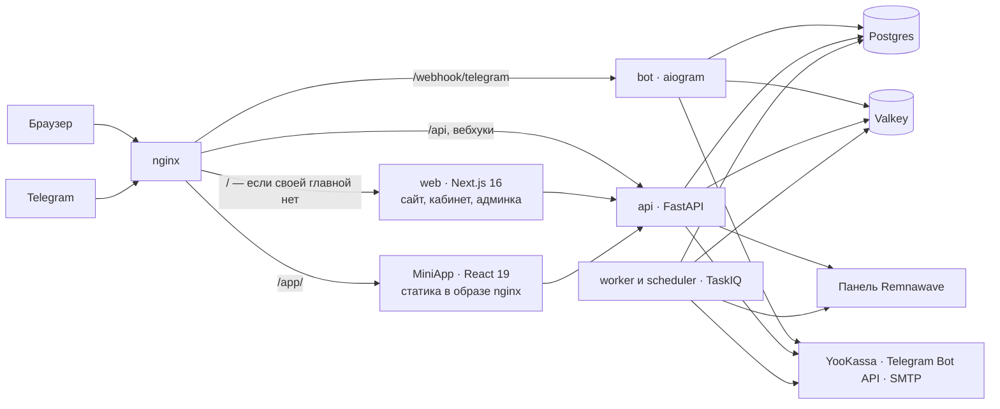

<div align="center">

<picture>
  <source media="(prefers-color-scheme: dark)" srcset="docs/design/logo/banner.svg">
  <source media="(prefers-color-scheme: light)" srcset="docs/design/logo/banner-light.svg">
  
</picture>

**Магазин VPN-подписок поверх вашей панели [Remnawave](https://remna.st) 3.2.1.
Telegram-бот, MiniApp и веб-кабинет — рядом с панелью, на вашем сервере.**

[](https://github.com/VAQYBIN/repibot-shop/actions/workflows/ci.yml)
[](LICENSE)
[](.python-version)
[](.github/workflows/ci.yml)
[](https://remna.st)

[Быстрый старт](#быстрый-старт) · [Возможности](#возможности) · [Архитектура](#архитектура) · [Разработка](#разработка) · [Документация](#документация)

</div>

## Что это

Открытый магазин подписок для тех, у кого уже есть панель Remnawave. Человек
приходит на сайт или в Telegram, выбирает тариф, платит и получает доступ;
панель узнаёт об этом сама. Разворачивается одним `docker compose up` рядом со
своей панелью — ни SaaS, ни чужого сервера в цепочке нет.

Подпроекты 0–7 реализованы: фундамент, идентичность, подписки, деньги,
коммуникации, админка, переработка дизайна и витрина. Изолированный
compose/Playwright контур проверяет YooKassa через локальную заглушку; внешняя
приёмка живой YooKassa, Telegram Stars, уведомлений и Remnawave 3.2.1 остаётся
отдельной операцией с выделенными sandbox-аккаунтами.

## Возможности

| Блок | Коротко |
|---|---|
| **Вход** | Почта с подтверждением, пароль, ключ доступа и Telegram — в браузере по OpenID Connect, в MiniApp по `initData` |
| **Подписки** | Тарифы из сквадов вашей панели, триал, устройства с отвязкой, трафик суммарно и по дням |
| **Панель** | Идемпотентное примирение, очередь при недоступности, вебхуки и плановая сверка |
| **Деньги** | YooKassa и Telegram Stars, промокоды, ваучеры, рефералы, автопродление, возвраты |
| **Коммуникации** | Напоминания, письма возврата, поддержка темами в супергруппе, рассылки по сегментам |
| **Админка** | Роли, поиск одной строкой, карточка человека с лентой начислений, выручка, ноды |
| **Витрина** | Лендинг с живыми ценами, юридические документы с версиями, подмена главной своим каталогом |
| **Внешний вид** | Кегли только из шкалы бренд-бука, сквозной обход тридцати экранов в двух темах |

<details>
<summary><b>Вход</b></summary>

Работает вход любым способом: регистрация по почте с подтверждением, пароль,
ключ доступа (passkey) и Telegram — в браузере по OpenID Connect, в MiniApp по
`initData`. Есть привязка и отвязка способов входа, профиль, язык, список
сессий и роли.

</details>

<details>
<summary><b>Подписки</b></summary>

Тарифы, подписка, устройства и трафик доступны в веб-кабинете и MiniApp. Админ
заводит тарифы через API из сквадов своей панели, пользователь с привязанным
Telegram активирует триал и получает ссылку подключения. Устройство можно
отвязать с подтверждением, а трафик виден суммарно и по дням.

</details>

<details>
<summary><b>Панель</b></summary>

Панель приводится к нашему состоянию идемпотентным примирением — при её
недоступности дни всё равно начисляются, а выдача доступа уходит в очередь и
дожимается воркером. Вебхуки Remnawave сбрасывают кэш устройств или ставят
примирение в очередь; плановая сверка записывает найденные расхождения.

</details>

<details>
<summary><b>Деньги</b></summary>

Есть заказы YooKassa и Stars, промокоды, подарочные ваучеры, реферальные
награды, автопродление, outbox-уведомления и админская отметка возврата с
отдельной подтверждаемой компенсацией. Карту запоминает галочка на форме
YooKassa, а не магазин: с ней оплата сохраняет карту и включает автоплатёж,
отвязка карты в кабинете его выключает. Безопасный production checklist — в
[развёртывании](docs/deployment.md#8-платежи-возвраты-и-автопродление).

</details>

<details>
<summary><b>Коммуникации</b></summary>

Человека находят напоминания об окончании подписки и письма возврата тем, кто
ушёл. Обращение в поддержку открывает тему в супергруппе персонала: в шапке —
карточка написавшего с тарифом, устройствами и днями до конца, статус виден
эмодзи прямо в названии темы, а закрыть, заглушить или заблокировать можно
командой оттуда же. Рассылки идут по сегментам с предпросмотром, паузой и
ссылкой отписки.

</details>

<details>
<summary><b>Админка</b></summary>

Админка собрана вокруг ролей: поддержка видит людей и обращения, администратор —
ещё выручку, платежи, рассылки и состояние нод панели. Человека ищут одной
строкой по почте, имени в Telegram или любому из номеров; в карточке — подписка,
единая лента начислений и платежей и действия над ней.

</details>

<details>
<summary><b>Витрина</b></summary>

Главная объясняет услугу, показывает живые цены из того же API, что и кабинет, и
отвечает на шесть вопросов; обещание пробного периода исчезает само, если
администратор выключил триальный тариф. Юридические документы заводит
администратор — своим текстом или загрузкой с Telegra.ph, откуда текст
переезжает к нам целиком. Опубликованная версия неизменяема, и на спор
«я покупал на других условиях» отвечает история, а не память. Пока документов
нет, о них не говорится нигде: ни в подвале, ни под кнопкой регистрации.

</details>

<details>
<summary><b>Внешний вид</b></summary>

Внешний вид доведён последним, когда набор экранов перестал расти. Кегли
задаются шкалой бренд-бука и только ею: встроенные размеры Tailwind погашены, а
тест обходит исходники и падает, если находит их след. Кабинет получил боковую
навигацию, MiniApp — нижние вкладки и главное действие в кнопке Телеграма,
админка — таблицы вместо ручной вёрстки. Сквозной обход проводит браузер по всем
тридцати экранам в светлой и тёмной теме и падает на ошибке в консоли,
горизонтальной прокрутке или странице без заголовка.

</details>

## Архитектура



Бизнес-логика живёт в `backend/core` и одинакова для сайта, MiniApp и бота:
роутер FastAPI и хендлер aiogram вызывают один и тот же сервис, поэтому вести
себя по-разному они не могут.

## Что внутри

| Каталог | Что там |
|---|---|
| `backend/core` | Бизнес-логика: домен, база, интеграции, сценарии |
| `backend/core/services/auth` | Способы входа и единственный путь выдачи сессии |
| `backend/core/integrations/telegram` | Обращения к Telegram: OpenID Connect и Bot API |
| `backend/api` | FastAPI: REST и вебхуки |
| `backend/bot` | Бот на aiogram |
| `backend/worker` | Фоновые задачи и расписание на TaskIQ |
| `frontend/apps/miniapp` | MiniApp: React 19 и Vite |
| `frontend/apps/web` | Сайт, кабинет и админка: Next.js 16 |
| `frontend/packages` | Общие пакеты: логика, компоненты, настройки инструментов |
| `docs/superpowers/specs` | Спецификации: архитектура платформы и подпроекты |
| `docs/design/logo` | Бренд-набор: знак, лок-апы, иконки, баннер. Собирается `uv run build-brand` |

## Быстрый старт

Нужны Docker, [uv](https://docs.astral.sh/uv/), Node 24 и pnpm 10.

```bash
cp .env.example .env
# заполнить BOT_TOKEN, BOT_WEBHOOK_SECRET, REMNAWAVE_TOKEN, JWT_SECRET,
# ADMIN_ASSERTION_SECRET, ENCRYPTION_KEY
docker compose up -d
curl http://localhost/health
```

Сайт откроется на `http://localhost/`, MiniApp — на `http://localhost/app/`.

Главную можно заменить своей страницей: положите её файлы в `./landing` рядом с
`compose.yml` — nginx отдаст ваш `index.html` вместо штатного лендинга, а
остальные адреса продолжат вести в приложение. Подробности, обязательные ссылки
и рабочий пример — в [своей главной странице](docs/deployment.md#12-своя-главная-страница).

## Разработка

```bash
uv sync
cd frontend && pnpm install && cd ..
uv run check
```

`uv run check` — единственная команда проверки: линтеры, типы и тесты обоих языков.
Ровно её же выполняет CI, поэтому «локально проходило» не бывает.

Локально бот удобнее запускать в режиме long polling: `BOT_USE_POLLING=true` в `.env`.

### Как получить письмо локально

Регистрация и сброс пароля работают по ссылке из письма, поэтому без почты дальше
формы не пройти. Два способа:

- **Mailpit.** `docker compose --profile dev up -d mailpit`, в `.env` поставить
  `EMAIL_SENDER=smtp`, `SMTP_HOST=mailpit`, `SMTP_PORT=1025` и перезапустить `worker`.
  Письма видны на `http://localhost:8025`.
- **Журнал.** `EMAIL_SENDER=log` (значение по умолчанию) и `LOG_LEVEL=DEBUG`: ссылка
  целиком печатается в `docker compose logs -f worker`. Почтовый сервер не нужен вовсе.

### Сквозные тесты

```bash
cd frontend && pnpm --filter @repibot/web exec playwright install chromium
pnpm --filter @repibot/web e2e
```

Тестам нужен Docker: они поднимают собственный стек отдельным проектом `repibot-e2e`
на портах 8081 (сайт), 8026 (Mailpit) и 3001 (HTTP-заглушка Remnawave, только
`127.0.0.1`) и берут настройки из
`frontend/apps/web/e2e/stack.env`, а не из вашего `.env`. Обычный стек при этом можно
не останавливать. Остановить тестовый:

```bash
docker compose -p repibot-e2e --env-file frontend/apps/web/e2e/stack.env \
  -f compose.yml -f frontend/apps/web/e2e/compose.e2e.yml --profile dev down -v
```

## Документация

- [Архитектура платформы](docs/superpowers/specs/2026-08-04-platform-architecture-design.md)
- [Спецификация фундамента](docs/superpowers/specs/2026-08-04-foundation-design.md)
- [Спецификация идентичности](docs/superpowers/specs/2026-08-05-identity-design.md)
- [Развёртывание](docs/deployment.md) и [эксплуатация поддержки и рассылок](docs/deployment.md#10-поддержка-напоминания-и-рассылки)
- [Бренд-бук](docs/design/repibot-brandbook.md)
- [Как участвовать](CONTRIBUTING.md) · [Кодекс поведения](CODE_OF_CONDUCT.md) · [Безопасность](SECURITY.md)

## Лицензия

AGPL-3.0. См. [LICENSE](LICENSE).
