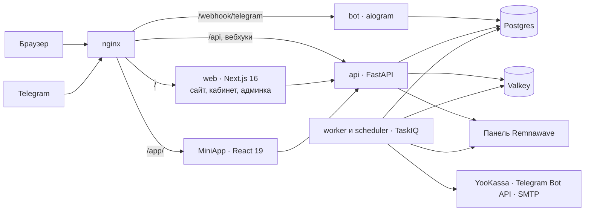

# Оформление репозитория

> **For agentic workers:** REQUIRED SUB-SKILL: Use superpowers:subagent-driven-development (recommended) or superpowers:executing-plans to implement this plan task-by-task. Steps use checkbox (`- [ ]`) syntax for tracking.

**Goal:** репозиторий получает баннер в шапке README, структурированное описание вместо сплошного текста и полный набор файлов сообщества.

**Architecture:** баннер выводится из той же геометрии, что и остальной бренд-набор, — генератором `tools/brand/build.py`, под сторожем `verify_generated`. README перестраивается в секции, ни одна нынешняя формулировка не теряется: абзацы переезжают под `<details>`. Файлы сообщества добавляются новыми, существующие правятся точечно.

**Tech Stack:** Python 3.13, pytest, SVG, Markdown, GitHub Issue Forms (YAML), mermaid.

## Global Constraints

- **Не выполняйте git-команд.** Коммит делает ведущий после проверки задачи.
- **Не запускайте `uv run check` целиком** — он не укладывается в лимит времени. Только команды из шагов.
- **Не трогайте `backend`, `frontend`, `docker`, `compose.yml`.** Эта работа их не касается.
- Комментарии и строки документации на русском, объясняют «почему», а не «что».
- `# noqa` без сработавшего правила запрещён: `RUF100` роняет проверку.
- Сначала тест, потом код.
- **Цвета только из `PALETTE`** (`tools/brand/geometry.py`): `#1A1A18`, `#FAF9F7`, `#17A67C`, `#2CC694`, `#E4F5EE`, `#F2F1ED`, `#FFFFFF`. Тест палитры параметризован по `FILES` и подхватит новые файлы сам.
- **Файлы в `docs/design/logo` руками не правятся.** Они появляются запуском `uv run build-brand`.
- Владелец репозитория: `VAQYBIN`, репозиторий: `repibot-shop`, ветка по умолчанию: `main`, разработка на `dev`.

## Файлы

| Файл | Что с ним |
|---|---|
| `tools/brand/build.py` | Добавляются `_lockup_h_body`, `banner_svg`, две константы и два элемента в `FILES`; `lockup_h_svg` становится обёрткой |
| `tools/verify_generated.py` | Два пути в наборе `build-brand` |
| `tools/tests/test_brand.py` | Три теста баннера |
| `tools/tests/test_docs.py` | Тест наличия файлов сообщества |
| `docs/design/logo/banner.svg` | Появляется генератором |
| `docs/design/logo/banner-light.svg` | Появляется генератором |
| `docs/design/repibot-brandbook.md` | Две строки в таблице раздела 8 |
| `README.md` | Переписывается целиком |
| `.github/ISSUE_TEMPLATE/bug_report.yml` | Создаётся |
| `.github/ISSUE_TEMPLATE/feature_request.yml` | Создаётся |
| `.github/ISSUE_TEMPLATE/config.yml` | Создаётся |
| `.github/PULL_REQUEST_TEMPLATE.md` | Создаётся |
| `SECURITY.md` | Создаётся |
| `CODE_OF_CONDUCT.md` | Создаётся |
| `CONTRIBUTING.md` | Две ссылки в конец |

---

### Задача 1: Баннер в бренд-наборе

**Files:**
- Modify: `tools/brand/build.py:56-67` (функция `lockup_h_svg`), `tools/brand/build.py:118-133` (словарь `FILES`)
- Modify: `tools/verify_generated.py:57-75`
- Modify: `tools/tests/test_brand.py:14-24` (импорты), конец файла
- Modify: `docs/design/repibot-brandbook.md`, раздел 8
- Создаются генератором: `docs/design/logo/banner.svg`, `docs/design/logo/banner-light.svg`

**Interfaces:**
- Consumes: `mark_markup`, `open_svg`, `FULL`, `INK`, `PAPER`, `JADE`, `JADE_BRIGHT`, `LIGHT` из `tools.brand.geometry`; `_wordmark_group`, `FONT_RATIO` из `tools.brand.build`; `ADVANCE`, `UNITS_PER_EM`, `X_HEIGHT` из `tools.brand.wordmark_paths`.
- Produces:
  - `_lockup_h_body(mark: Mark, spiral: str, core: str, letters: str, colon: str) -> tuple[str, float, float]` — разметка, ширина, высота.
  - `banner_svg(background: str, spiral: str, core: str, letters: str, colon: str) -> str`.
  - `BANNER_WIDTH = 1280`, `BANNER_HEIGHT = 320`, `BANNER_RATIO = 0.34`.
  - Файлы `docs/design/logo/banner.svg` и `docs/design/logo/banner-light.svg` — на них ссылается README в задаче 2.

- [ ] **Шаг 1: Написать падающие тесты**

В конец `tools/tests/test_brand.py`:

```python
BANNER_FILES = ("banner.svg", "banner-light.svg")


@pytest.mark.parametrize("name", BANNER_FILES)
def test_banner_canvas_is_wide_and_short(name: str) -> None:
    """Шапка README — широкая полоса: квадрат вытолкнул бы текст за первый экран."""
    content = (LOGO_DIR / name).read_text(encoding="utf-8")

    assert 'viewBox="0 0 1280 320"' in content


@pytest.mark.parametrize("name", BANNER_FILES)
def test_banner_draws_the_same_spiral_as_the_rest(name: str) -> None:
    """Расхождение геометрии между файлами — то, о чём предупреждает раздел 8."""
    assert FULL.path in (LOGO_DIR / name).read_text(encoding="utf-8")


def test_banner_keeps_the_clear_space_of_the_brandbook() -> None:
    """Раздел 5: вокруг лок-апа остаётся не меньше половины высоты знака."""
    content = (LOGO_DIR / "banner.svg").read_text(encoding="utf-8")
    match = re.search(r"translate\([\d.]+ ([\d.]+)\) scale\(([\d.]+)\)", content)

    assert match is not None
    top, scale = float(match.group(1)), float(match.group(2))

    assert top >= FULL.height * scale / 2


def test_banner_pair_differs_by_theme_only() -> None:
    """Ink-полотно в светлой теме GitHub — чёрный прямоугольник посреди страницы."""
    dark = (LOGO_DIR / "banner.svg").read_text(encoding="utf-8")
    light = (LOGO_DIR / "banner-light.svg").read_text(encoding="utf-8")

    assert f'<rect width="1280" height="320" fill="{INK}"/>' in dark
    assert f'<rect width="1280" height="320" fill="{PAPER}"/>' in light
```

В блок импортов из `tools.brand.geometry` (строки 15–24) добавить `INK` и `PAPER`, сохранив алфавитный порядок:

```python
from tools.brand.geometry import (
    CURRENT,
    FULL,
    INK,
    JADE,
    PALETTE,
    PAPER,
    SMALL,
    Mark,
    badge_svg,
    mark_svg,
)
```

- [ ] **Шаг 2: Убедиться, что тесты падают**

Run: `uv run pytest tools/tests/test_brand.py -q -k banner`
Expected: FAIL — файлов `banner.svg` и `banner-light.svg` нет, `FileNotFoundError`.

- [ ] **Шаг 3: Выделить тело горизонтального лок-апа**

В `tools/brand/build.py` заменить функцию `lockup_h_svg` (строки 56–67) на пару функций. Вывод `lockup_h_svg` при этом не меняется ни на байт — это рефакторинг, а не правка результата:

```python
def _lockup_h_body(
    mark: Mark, spiral: str, core: str, letters: str, colon: str
) -> tuple[str, float, float]:
    """Разметка горизонтального лок-апа и его габарит.

    Габарит возвращается наружу по той же причине, что и у вертикального:
    баннер вписывает лок-ап в свой холст, и считать его размер второй раз
    означало бы завести вторую версию правды.
    """
    size = mark.height * FONT_RATIO
    scale = size / UNITS_PER_EM
    x = mark.width + X_HEIGHT * scale
    # Оптический центр надписи — середина полосы строчных, а не базовая линия.
    baseline = mark.height / 2 + X_HEIGHT * scale / 2
    body = (
        f"{mark_markup(mark, spiral, core)}"
        f"{_wordmark_group(scale, x, baseline, letters, colon)}"
    )
    return body, x + ADVANCE * scale, mark.height


def lockup_h_svg(mark: Mark = FULL, letters: str = INK, colon: str = JADE) -> str:
    """Знак слева, вордмарк справа. Просвет — высота строчной x, раздел 5."""
    body, width, height = _lockup_h_body(mark, INK, JADE, letters, colon)
    return f"{open_svg(width, height, 'Re:Pibot')}{body}</svg>"
```

- [ ] **Шаг 4: Добавить баннер**

После функции `og_image_svg` (после строки 115) в `tools/brand/build.py`:

```python
BANNER_WIDTH = 1280
BANNER_HEIGHT = 320
# Доля ширины холста под лок-ап. Масштаб задаётся по ширине: полоса вытянутая,
# высота получается сама. При 0.34 поле сверху и снизу выходит 89 px против
# минимальных 71 px раздела 5 — больше, и охранное поле схлопнется.
BANNER_RATIO = 0.34


def banner_svg(background: str, spiral: str, core: str, letters: str, colon: str) -> str:
    """Полотно для шапки README: лок-ап по центру, остальное — воздух.

    Две версии вместо одной: GitHub показывает README в теме читателя, и
    полотно на Ink в светлой теме выглядит чёрной заплатой посреди страницы.
    """
    body, width, height = _lockup_h_body(FULL, spiral, core, letters, colon)
    scale = BANNER_WIDTH * BANNER_RATIO / width
    x = (BANNER_WIDTH - width * scale) / 2
    y = (BANNER_HEIGHT - height * scale) / 2
    opening = open_svg(BANNER_WIDTH, BANNER_HEIGHT, "Re:Pibot Shop — магазин VPN-подписок")
    return (
        f'{opening}<rect width="{BANNER_WIDTH}" height="{BANNER_HEIGHT}" fill="{background}"/>'
        f'<g transform="translate({x:.2f} {y:.2f}) scale({scale:.4f})">{body}</g></svg>'
    )
```

Добавить `PAPER` в импорт из `tools.brand.geometry` в начале файла (строки 13–28). Порядок имён там `CURRENT, FULL, INK, JADE, JADE_BRIGHT, JADE_MIST, LIGHT, SMALL, WHITE, Mark, badge_svg, mark_markup, mark_svg, open_svg` — `PAPER` встаёт между `LIGHT` и `SMALL`.

В словарь `FILES` после `"og-image.svg"` добавить:

```python
    # Шапка README. На Ink обычный Jade мутнеет — ядро Jade Bright, раздел 2.
    "banner.svg": banner_svg(INK, LIGHT, JADE_BRIGHT, LIGHT, JADE_BRIGHT),
    "banner-light.svg": banner_svg(PAPER, INK, JADE, INK, JADE),
```

- [ ] **Шаг 5: Собрать бренд-набор**

Run: `uv run build-brand`
Expected: `Собрано файлов: 15`

- [ ] **Шаг 6: Прогнать тесты баннера**

Run: `uv run pytest tools/tests/test_brand.py -q`
Expected: PASS, включая параметризованный тест палитры по новым файлам.

- [ ] **Шаг 7: Внести пути под сторож**

В `tools/verify_generated.py`, в набор путей команды `build-brand` (строки 58–72), после `Path("docs/design/logo/og-image.svg")`:

```python
            Path("docs/design/logo/banner.svg"),
            Path("docs/design/logo/banner-light.svg"),
```

Строку документации класса `Generated` (строки 25–29) поправить: «пишет тринадцать за раз» → «пишет пятнадцать за раз».

- [ ] **Шаг 8: Проверить сторож**

Run: `uv run verify-generated`
Expected: `Сгенерированные файлы актуальны.` — в том числе прежние файлы лок-апа, что подтверждает: рефакторинг шага 3 вывод не изменил.

- [ ] **Шаг 9: Дописать бренд-бук**

В `docs/design/repibot-brandbook.md`, в таблицу раздела 8, после строки `` `avatar.svg`, `og-image.svg` ``:

```markdown
| `banner.svg`, `banner-light.svg` | шапка README, тёмная и светлая |
```

И абзацем ниже таблицы, перед словами «Растры в `docs/design/logo/raster`»:

```markdown
Баннер существует в двух версиях не для красоты: GitHub показывает README в
теме читателя, и одна версия из двух непременно оказалась бы заплатой чужого
цвета. Выбор делает `<picture>` в README, а не человек.
```

- [ ] **Шаг 10: Проверить статику и типы**

Run: `uv run ruff check tools && uv run ruff format --check tools && uv run mypy tools`
Expected: без замечаний.

- [ ] **Шаг 11: Прогнать тесты инструментов целиком**

Run: `uv run pytest tools/tests -q`
Expected: PASS.

Готово к проверке ведущим.

---

### Задача 2: README

**Files:**
- Modify: `README.md` (переписывается целиком)

**Interfaces:**
- Consumes: `docs/design/logo/banner.svg`, `docs/design/logo/banner-light.svg` из задачи 1.
- Produces: ссылки `SECURITY.md`, `CODE_OF_CONDUCT.md` — файлы появятся в задачах 3 и 4; до тех пор ссылки ведут в пустоту, и это ожидаемо.

**Что нельзя потерять.** `tools/tests/test_docs.py` требует, чтобы в README оставались подстроки `docker compose up`, `uv run check`, `.env.example`, `docs/superpowers/specs`, `docs/design/logo`. Все пять присутствуют в тексте ниже — не вычищайте их при правках.

- [ ] **Шаг 1: Убедиться, что сторожа README сейчас зелёные**

Run: `uv run pytest tools/tests/test_docs.py -q`
Expected: PASS. Это отправная точка: те же тесты должны остаться зелёными после переписывания.

- [ ] **Шаг 2: Записать README целиком**

Заменить содержимое `README.md` на:

````markdown
<div align="center">

<picture>
  <source media="(prefers-color-scheme: dark)" srcset="docs/design/logo/banner.svg">
  <source media="(prefers-color-scheme: light)" srcset="docs/design/logo/banner-light.svg">
  
</picture>

**Магазин VPN-подписок поверх вашей панели [Remnawave](https://remna.st) 3.2.1.
Telegram-бот, MiniApp и веб-кабинет — рядом с панелью, на вашем сервере.**

[](https://github.com/VAQYBIN/repibot-shop/actions/workflows/ci.yml)
[](LICENSE)
[](.python-version)
[](.github/workflows/ci.yml)
[](https://remna.st)

[Быстрый старт](#быстрый-старт) · [Возможности](#возможности) · [Архитектура](#архитектура) · [Разработка](#разработка) · [Документация](#документация)

</div>

## Что это

Открытый магазин подписок для тех, у кого уже есть панель Remnawave. Человек
приходит на сайт или в Telegram, выбирает тариф, платит и получает доступ;
панель узнаёт об этом сама. Разворачивается одним `docker compose up` рядом со
своей панелью — ни SaaS, ни чужого сервера в цепочке нет.

Подпроекты 0–7 реализованы: фундамент, идентичность, подписки, деньги,
коммуникации, админка, переработка дизайна и витрина. Изолированный
compose/Playwright контур проверяет YooKassa через локальную заглушку; внешняя
приёмка живой YooKassa, Telegram Stars, уведомлений и Remnawave 3.2.1 остаётся
отдельной операцией с выделенными sandbox-аккаунтами.

## Возможности

| Блок | Коротко |
|---|---|
| [Вход](#вход) | Почта с подтверждением, пароль, ключ доступа и Telegram — в браузере по OpenID Connect, в MiniApp по `initData` |
| [Подписки](#подписки) | Тарифы из сквадов вашей панели, триал, устройства с отвязкой, трафик суммарно и по дням |
| [Панель](#панель) | Идемпотентное примирение, очередь при недоступности, вебхуки и плановая сверка |
| [Деньги](#деньги) | YooKassa и Telegram Stars, промокоды, ваучеры, рефералы, автопродление, возвраты |
| [Коммуникации](#коммуникации) | Напоминания, письма возврата, поддержка темами в супергруппе, рассылки по сегментам |
| [Админка](#админка) | Роли, поиск одной строкой, карточка человека с лентой начислений, выручка, ноды |
| [Витрина](#витрина) | Лендинг с живыми ценами, юридические документы с версиями, подмена главной своим каталогом |
| [Внешний вид](#внешний-вид) | Кегли только из шкалы бренд-бука, сквозной обход тридцати экранов в двух темах |

<details>
<summary><b>Вход</b></summary>

Работает вход любым способом: регистрация по почте с подтверждением, пароль,
ключ доступа (passkey) и Telegram — в браузере по OpenID Connect, в MiniApp по
`initData`. Есть привязка и отвязка способов входа, профиль, язык, список
сессий и роли.

</details>

<details>
<summary><b>Подписки</b></summary>

Тарифы, подписка, устройства и трафик доступны в веб-кабинете и MiniApp. Админ
заводит тарифы через API из сквадов своей панели, пользователь с привязанным
Telegram активирует триал и получает ссылку подключения. Устройство можно
отвязать с подтверждением, а трафик виден суммарно и по дням.

</details>

<details>
<summary><b>Панель</b></summary>

Панель приводится к нашему состоянию идемпотентным примирением — при её
недоступности дни всё равно начисляются, а выдача доступа уходит в очередь и
дожимается воркером. Вебхуки Remnawave сбрасывают кэш устройств или ставят
примирение в очередь; плановая сверка записывает найденные расхождения.

</details>

<details>
<summary><b>Деньги</b></summary>

Есть заказы YooKassa и Stars, промокоды, подарочные ваучеры, реферальные
награды, автопродление, outbox-уведомления и админская отметка возврата с
отдельной подтверждаемой компенсацией. Карту запоминает галочка на форме
YooKassa, а не магазин: с ней оплата сохраняет карту и включает автоплатёж,
отвязка карты в кабинете его выключает. Безопасный production checklist — в
[развёртывании](docs/deployment.md#8-платежи-возвраты-и-автопродление).

</details>

<details>
<summary><b>Коммуникации</b></summary>

Человека находят напоминания об окончании подписки и письма возврата тем, кто
ушёл. Обращение в поддержку открывает тему в супергруппе персонала: в шапке —
карточка написавшего с тарифом, устройствами и днями до конца, статус виден
эмодзи прямо в названии темы, а закрыть, заглушить или заблокировать можно
командой оттуда же. Рассылки идут по сегментам с предпросмотром, паузой и
ссылкой отписки.

</details>

<details>
<summary><b>Админка</b></summary>

Админка собрана вокруг ролей: поддержка видит людей и обращения, администратор —
ещё выручку, платежи, рассылки и состояние нод панели. Человека ищут одной
строкой по почте, имени в Telegram или любому из номеров; в карточке — подписка,
единая лента начислений и платежей и действия над ней.

</details>

<details>
<summary><b>Витрина</b></summary>

Главная объясняет услугу, показывает живые цены из того же API, что и кабинет, и
отвечает на шесть вопросов; обещание пробного периода исчезает само, если
администратор выключил триальный тариф. Юридические документы заводит
администратор — своим текстом или загрузкой с Telegra.ph, откуда текст
переезжает к нам целиком. Опубликованная версия неизменяема, и на спор
«я покупал на других условиях» отвечает история, а не память. Пока документов
нет, о них не говорится нигде: ни в подвале, ни под кнопкой регистрации.

</details>

<details>
<summary><b>Внешний вид</b></summary>

Внешний вид доведён последним, когда набор экранов перестал расти. Кегли
задаются шкалой бренд-бука и только ею: встроенные размеры Tailwind погашены, а
тест обходит исходники и падает, если находит их след. Кабинет получил боковую
навигацию, MiniApp — нижние вкладки и главное действие в кнопке Телеграма,
админка — таблицы вместо ручной вёрстки. Сквозной обход проводит браузер по всем
тридцати экранам в светлой и тёмной теме и падает на ошибке в консоли,
горизонтальной прокрутке или странице без заголовка.

</details>

## Архитектура



Бизнес-логика живёт в `backend/core` и одинакова для сайта, MiniApp и бота:
роутер FastAPI и хендлер aiogram вызывают один и тот же сервис, поэтому вести
себя по-разному они не могут.

## Что внутри

| Каталог | Что там |
|---|---|
| `backend/core` | Бизнес-логика: домен, база, интеграции, сценарии |
| `backend/core/services/auth` | Способы входа и единственный путь выдачи сессии |
| `backend/core/integrations/telegram` | Обращения к Telegram: OpenID Connect и Bot API |
| `backend/api` | FastAPI: REST и вебхуки |
| `backend/bot` | Бот на aiogram |
| `backend/worker` | Фоновые задачи и расписание на TaskIQ |
| `frontend/apps/miniapp` | MiniApp: React 19 и Vite |
| `frontend/apps/web` | Сайт, кабинет и админка: Next.js 16 |
| `frontend/packages` | Общие пакеты: логика, компоненты, настройки инструментов |
| `docs/superpowers/specs` | Спецификации: архитектура платформы и подпроекты |
| `docs/design/logo` | Бренд-набор: знак, лок-апы, иконки, баннер. Собирается `uv run build-brand` |

## Быстрый старт

Нужны Docker, [uv](https://docs.astral.sh/uv/), Node 24 и pnpm 10.

```bash
cp .env.example .env
# заполнить BOT_TOKEN, BOT_WEBHOOK_SECRET, REMNAWAVE_TOKEN, JWT_SECRET,
# ADMIN_ASSERTION_SECRET, ENCRYPTION_KEY
docker compose up -d
curl http://localhost/health
```

Сайт откроется на `http://localhost/`, MiniApp — на `http://localhost/app/`.

Главную можно заменить своей страницей: положите её файлы в `./landing` рядом с
`compose.yml` — nginx отдаст ваш `index.html` вместо штатного лендинга, а
остальные адреса продолжат вести в приложение. Подробности, обязательные ссылки
и рабочий пример — в [своей главной странице](docs/deployment.md#12-своя-главная-страница).

## Разработка

```bash
uv sync
cd frontend && pnpm install && cd ..
uv run check
```

`uv run check` — единственная команда проверки: линтеры, типы и тесты обоих языков.
Ровно её же выполняет CI, поэтому «локально проходило» не бывает.

Локально бот удобнее запускать в режиме long polling: `BOT_USE_POLLING=true` в `.env`.

### Как получить письмо локально

Регистрация и сброс пароля работают по ссылке из письма, поэтому без почты дальше
формы не пройти. Два способа:

- **Mailpit.** `docker compose --profile dev up -d mailpit`, в `.env` поставить
  `EMAIL_SENDER=smtp`, `SMTP_HOST=mailpit`, `SMTP_PORT=1025` и перезапустить `worker`.
  Письма видны на `http://localhost:8025`.
- **Журнал.** `EMAIL_SENDER=log` (значение по умолчанию) и `LOG_LEVEL=DEBUG`: ссылка
  целиком печатается в `docker compose logs -f worker`. Почтовый сервер не нужен вовсе.

### Сквозные тесты

```bash
cd frontend && pnpm --filter @repibot/web exec playwright install chromium
pnpm --filter @repibot/web e2e
```

Тестам нужен Docker: они поднимают собственный стек отдельным проектом `repibot-e2e`
на портах 8081 (сайт), 8026 (Mailpit) и 3001 (HTTP-заглушка Remnawave, только
`127.0.0.1`) и берут настройки из
`frontend/apps/web/e2e/stack.env`, а не из вашего `.env`. Обычный стек при этом можно
не останавливать. Остановить тестовый:

```bash
docker compose -p repibot-e2e --env-file frontend/apps/web/e2e/stack.env \
  -f compose.yml -f frontend/apps/web/e2e/compose.e2e.yml --profile dev down -v
```

## Документация

- [Архитектура платформы](docs/superpowers/specs/2026-08-04-platform-architecture-design.md)
- [Спецификация фундамента](docs/superpowers/specs/2026-08-04-foundation-design.md)
- [Спецификация идентичности](docs/superpowers/specs/2026-08-05-identity-design.md)
- [Развёртывание](docs/deployment.md) и [эксплуатация поддержки и рассылок](docs/deployment.md#10-поддержка-напоминания-и-рассылки)
- [Бренд-бук](docs/design/repibot-brandbook.md)
- [Как участвовать](CONTRIBUTING.md) · [Кодекс поведения](CODE_OF_CONDUCT.md) · [Безопасность](SECURITY.md)

## Лицензия

AGPL-3.0. См. [LICENSE](LICENSE).
````

- [ ] **Шаг 3: Проверить, что сторожа README остались зелёными**

Run: `uv run pytest tools/tests/test_docs.py -q`
Expected: PASS. Если упал `test_readme_covers_local_start` или `test_readme_documents_where_specs_live` — при переписывании потеряна одна из обязательных подстрок, верните её.

- [ ] **Шаг 4: Проверить разметку глазами**

Открыть `README.md` в предпросмотре Markdown и убедиться:
- баннер виден, страница не едет вбок;
- все восемь `<details>` раскрываются, внутри — текст, а не сырой HTML (после `<summary>` обязана быть пустая строка);
- ссылки оглавления ведут к своим заголовкам;
- блок mermaid отрисован схемой, а не кодом.

Готово к проверке ведущим.

---

### Задача 3: Шаблоны issue и pull request

**Files:**
- Create: `.github/ISSUE_TEMPLATE/bug_report.yml`
- Create: `.github/ISSUE_TEMPLATE/feature_request.yml`
- Create: `.github/ISSUE_TEMPLATE/config.yml`
- Create: `.github/PULL_REQUEST_TEMPLATE.md`

**Interfaces:**
- Consumes: метки `bug` и `enhancement` — обе уже заведены в репозитории.
- Produces: ничего, чем пользуются другие задачи.

- [ ] **Шаг 1: Отчёт об ошибке**

Создать `.github/ISSUE_TEMPLATE/bug_report.yml`:

```yaml
name: Отчёт об ошибке
description: Что-то работает не так, как описано в документации
labels: ["bug"]
body:
  - type: markdown
    attributes:
      value: |
        Перед тем как прикладывать журналы, вычистите из них секреты.
        `.env` проекта содержит токен бота, ключ панели и `JWT_SECRET` —
        первый же приложенный лог отдаёт их всем читателям.

  - type: dropdown
    id: area
    attributes:
      label: Где проявилось
      options:
        - Сайт и кабинет
        - MiniApp
        - Бот
        - API
        - Воркер и расписание
        - Развёртывание
    validations:
      required: true

  - type: textarea
    id: what
    attributes:
      label: Что произошло
      description: Что вы увидели вместо ожидаемого.
    validations:
      required: true

  - type: textarea
    id: steps
    attributes:
      label: Как повторить
      description: По шагам, от чистого стека, если это возможно.
      placeholder: |
        1. docker compose up -d
        2. Открыть http://localhost/
        3. ...
    validations:
      required: true

  - type: textarea
    id: expected
    attributes:
      label: Чего вы ожидали
    validations:
      required: true

  - type: input
    id: version
    attributes:
      label: Версия или коммит
      description: Вывод `git rev-parse --short HEAD`.
    validations:
      required: true

  - type: textarea
    id: logs
    attributes:
      label: Журналы
      description: Вывод `docker compose logs --tail=100`, без секретов.
      render: shell

  - type: checkboxes
    id: hygiene
    attributes:
      label: Перед отправкой
      options:
        - label: Я поискал среди открытых issue — такой ещё нет
          required: true
        - label: В приложенном выводе нет токенов, паролей и ключей
          required: true
```

- [ ] **Шаг 2: Запрос возможности**

Создать `.github/ISSUE_TEMPLATE/feature_request.yml`:

```yaml
name: Запрос возможности
description: Чего проекту не хватает
labels: ["enhancement"]
body:
  - type: textarea
    id: problem
    attributes:
      label: Какую задачу это решает
      description: Опишите ситуацию, а не готовое решение — решений может быть несколько.
    validations:
      required: true

  - type: textarea
    id: workaround
    attributes:
      label: Как вы обходитесь сейчас
      description: Если никак — так и напишите.
    validations:
      required: true

  - type: textarea
    id: proposal
    attributes:
      label: Что предлагаете
    validations:
      required: true

  - type: dropdown
    id: contribution
    attributes:
      label: Готовы прислать pull request?
      options:
        - Да
        - Нужна помощь с началом
        - Нет
    validations:
      required: true
```

- [ ] **Шаг 3: Настройка выбора**

Создать `.github/ISSUE_TEMPLATE/config.yml`:

```yaml
# Пустой issue без версии и шагов воспроизведения дороже обходится обеим
# сторонам: сначала неделя переписки, потом выясняется, что дело в настройках.
blank_issues_enabled: false
contact_links:
  - name: Вопрос по развёртыванию
    url: https://github.com/VAQYBIN/repibot-shop/blob/main/docs/deployment.md
    about: Настройка BotFather, платежей, поддержки и своей главной страницы описана здесь.
  - name: Уязвимость
    url: https://github.com/VAQYBIN/repibot-shop/security/advisories/new
    about: Не открывайте issue. Сообщите приватно — так уязвимость не окажется публичной до исправления.
```

- [ ] **Шаг 4: Шаблон pull request**

Создать `.github/PULL_REQUEST_TEMPLATE.md`:

```markdown
## Что меняется и зачем

<!-- Пара предложений. Если есть issue — сошлитесь: «Закрывает #123». -->

## Проверка

- [ ] `uv run check` проходит целиком
- [ ] Изменение сопровождается тестом, и тест падал до реализации
- [ ] Сгенерированные файлы перегенерированы генератором, а не правлены руками
- [ ] Спецификация в `docs/superpowers/specs/` обновлена, если менялось поведение
- [ ] Ветка ответвлена от `dev` и вливается в `dev`
- [ ] В диффе нет секретов: токенов, паролей, ключей, содержимого `.env`
```

- [ ] **Шаг 5: Проверить синтаксис форм**

Run: `uv run python -c "import pathlib,yaml;[yaml.safe_load(p.read_text(encoding='utf-8')) for p in pathlib.Path('.github/ISSUE_TEMPLATE').glob('*.yml')];print('формы разобраны')"`
Expected: `формы разобраны`

Если `yaml` не установлен, команда упадёт с `ModuleNotFoundError` — тогда пропустите шаг: GitHub разберёт формы сам и покажет ошибку в интерфейсе.

Готово к проверке ведущим.

---

### Задача 4: Политика безопасности, кодекс поведения и сторож

**Files:**
- Create: `SECURITY.md`
- Create: `CODE_OF_CONDUCT.md`
- Modify: `CONTRIBUTING.md` (конец файла)
- Modify: `tools/tests/test_docs.py`

**Interfaces:**
- Consumes: ссылки из README, добавленные в задаче 2.
- Produces: тест `test_community_files_exist`, закрывающий набор файлов сообщества.

- [ ] **Шаг 1: Написать падающий тест**

В `tools/tests/test_docs.py`, после `test_required_documents_exist` (строка 15):

```python
COMMUNITY_FILES = (
    "SECURITY.md",
    "CODE_OF_CONDUCT.md",
    ".github/PULL_REQUEST_TEMPLATE.md",
    ".github/ISSUE_TEMPLATE/bug_report.yml",
    ".github/ISSUE_TEMPLATE/feature_request.yml",
    ".github/ISSUE_TEMPLATE/config.yml",
)


@pytest.mark.parametrize("name", COMMUNITY_FILES)
def test_community_files_exist(name: str) -> None:
    """README на них ссылается, а GitHub показывает их в интерфейсе.

    Пропавший файл превращает и то и другое в ссылку на 404.
    """
    assert (ROOT / name).is_file()


def test_readme_shows_the_banner() -> None:
    """Шапка — единственное, что видно до прокрутки."""
    readme = (ROOT / "README.md").read_text(encoding="utf-8")

    assert "docs/design/logo/banner.svg" in readme
    assert "docs/design/logo/banner-light.svg" in readme
```

- [ ] **Шаг 2: Убедиться, что тест падает**

Run: `uv run pytest tools/tests/test_docs.py -q -k "community or banner"`
Expected: FAIL на `SECURITY.md` и `CODE_OF_CONDUCT.md` — их ещё нет. Тесты по `.github/` и баннеру пройдут: задачи 1–3 их уже создали.

- [ ] **Шаг 3: Политика безопасности**

Создать `SECURITY.md`:

```markdown
# Безопасность

## Что поддерживается

Исправления выходят для ветки `main`. Отдельных поддерживаемых веток и
долгоживущих релизов у проекта нет: обновление — это `git pull` и пересборка
образов.

## Как сообщить об уязвимости

Не открывайте issue: она видна всем ещё до того, как появится исправление.

Откройте [приватный отчёт](https://github.com/VAQYBIN/repibot-shop/security/advisories/new)
на вкладке Security → Report a vulnerability. Переписка, исправление и, если
понадобится, CVE останутся в одном месте.

Опишите, что удалось сделать и как это повторить. Ответ приходит в течение
недели. Вознаграждения проект не платит — это работа одного человека, а не
компании; авторство исправления указывается, если вы не против.

## Что вне зоны ответственности

Проект отвечает за свой код. За пределами:

- **Ваша панель Remnawave.** Её уязвимости — к [её авторам](https://remna.st).
- **Ваши настройки.** Открытый наружу Postgres, `DEBUG` в проде, слабый
  `JWT_SECRET`, отсутствие TLS перед nginx.
- **Ваши ключи.** Утёкший `BOT_TOKEN` или `REMNAWAVE_TOKEN` отзывается у того,
  кто его выдал.
- **Платёжные провайдеры.** YooKassa и Telegram принимают сообщения об
  уязвимостях сами.

## Что помогает вам

- `.env` не попадает в репозиторий, и в журнале нет паролей, токенов и
  одноразовых ссылок — это правило проверяется, а не подразумевается.
- Веб-контейнер не получает общий `.env`: токена бота и ключей платежей у него
  нет вовсе.
- Эндпоинт импорта юридических документов ходит только на `telegra.ph` —
  произвольный адрес позволил бы простукивать внутреннюю сеть снаружи.
- Безопасный порядок обращения с платежами и возвратами описан в
  [развёртывании](docs/deployment.md#8-платежи-возвраты-и-автопродление).
```

- [ ] **Шаг 4: Кодекс поведения**

Создать `CODE_OF_CONDUCT.md`:

```markdown
# Кодекс поведения участника

## Наше обязательство

Мы, участники и сопровождающие проекта, обязуемся сделать участие в нём
свободным от притеснений для всех — независимо от возраста, телосложения,
видимой или невидимой инвалидности, этнической принадлежности, половых
признаков, гендерной идентичности и выражения, уровня опыта, образования,
социального положения, национальности, внешности, расы, религии, сексуальной
идентичности и ориентации.

Мы обязуемся действовать и взаимодействовать так, чтобы вклад в проект был
открытым, дружелюбным, разнообразным и здоровым.

## Наши нормы

Поведение, которое создаёт здоровую среду:

- сочувствие и доброжелательность к другим;
- уважение к чужому мнению, взглядам и опыту;
- готовность давать и с достоинством принимать конструктивные замечания;
- признание ответственности, извинение перед теми, кого задела наша ошибка, и
  извлечение из неё урока;
- забота не только о себе, но и обо всём сообществе.

Недопустимое поведение:

- сексуализированные высказывания, образы и внимание любого рода;
- троллинг, оскорбления, уничижительные комментарии, нападки на личность или
  политические взгляды;
- публичные или частные притеснения;
- публикация чужих личных данных — почтового или физического адреса — без явного
  разрешения;
- иное поведение, которое в профессиональной среде обоснованно сочли бы
  неприемлемым.

## Обязанности сопровождающих

Сопровождающие проекта разъясняют нормы приемлемого поведения и принимают
справедливые корректирующие меры в ответ на поведение, которое считают
неуместным, угрожающим, оскорбительным или вредным.

Сопровождающие вправе удалять, редактировать и отклонять комментарии, коммиты,
код, правки вики, issue и прочий вклад, не соответствующий этому кодексу, и
сообщать причины такого решения, когда это уместно.

## Область действия

Кодекс действует во всех пространствах проекта, а также в случаях, когда
участник официально представляет проект в публичном пространстве: пишет с
официального адреса, публикует с официального аккаунта или выступает на
мероприятии.

## Применение

О случаях оскорбительного, притесняющего или иного неприемлемого поведения
сообщайте сопровождающему проекта приватным сообщением на GitHub —
[@VAQYBIN](https://github.com/VAQYBIN). Все жалобы рассматриваются оперативно и
беспристрастно.

Сопровождающие обязаны уважать неприкосновенность частной жизни и безопасность
того, кто сообщил о происшествии.

## Порядок мер

**1. Замечание.** За неуместное поведение или иное нарушение норм — приватное
письменное замечание с разъяснением, в чём нарушение. Может быть запрошено
публичное извинение.

**2. Предупреждение.** За нарушение в результате единичного случая или череды
действий — предупреждение с указанием последствий продолжения. Полное отсутствие
взаимодействия с вовлечёнными людьми в течение назначенного срока. Нарушение
этих условий ведёт к временному или бессрочному запрету.

**3. Временный запрет.** За серьёзное нарушение норм, в том числе за устойчиво
неуместное поведение, — временный запрет на любое взаимодействие и публичное
общение в рамках проекта. Нарушение условий ведёт к бессрочному запрету.

**4. Бессрочный запрет.** За систематические нарушения, притеснение отдельного
человека, агрессию или пренебрежение к группам людей — бессрочный запрет на
любое публичное взаимодействие в рамках проекта.

## Источник

Кодекс основан на [Contributor Covenant](https://www.contributor-covenant.org)
версии 2.1, доступном по адресу
<https://www.contributor-covenant.org/version/2/1/code_of_conduct.html>.
```

- [ ] **Шаг 5: Ссылки в CONTRIBUTING**

В конец `CONTRIBUTING.md`, после раздела «Крупные изменения», добавить:

```markdown
## Ещё два документа

- [Кодекс поведения](CODE_OF_CONDUCT.md) — чего мы ждём друг от друга в issue и
  обсуждениях.
- [Безопасность](SECURITY.md) — куда сообщать об уязвимости. Не в issue: она
  видна всем до того, как появится исправление.
```

- [ ] **Шаг 6: Прогнать тесты документации**

Run: `uv run pytest tools/tests/test_docs.py -q`
Expected: PASS.

- [ ] **Шаг 7: Проверить статику**

Run: `uv run ruff check tools && uv run ruff format --check tools && uv run mypy tools`
Expected: без замечаний.

- [ ] **Шаг 8: Прогнать тесты инструментов целиком**

Run: `uv run pytest tools/tests -q`
Expected: PASS.

Готово к проверке ведущим.

---

## После плана — вручную владельцем

Одно действие живёт в настройках GitHub и коду не подчиняется:
**Settings → Code security → Private vulnerability reporting → Enable**.
Без этой галочки ссылка из `SECURITY.md` и `config.yml` на
`/security/advisories/new` отвечает 404.
